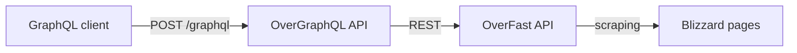
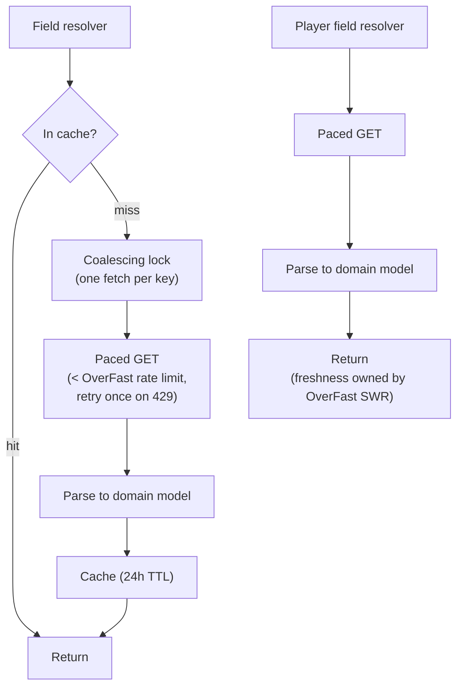
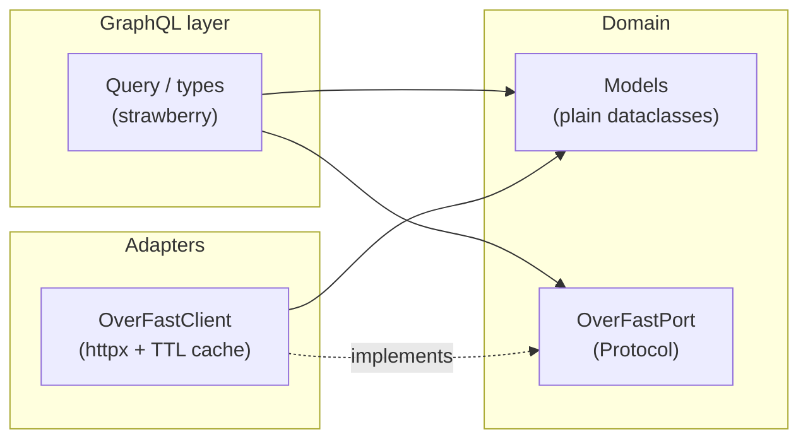

# 🕸️ OverGraphQL API

[](https://github.com/TeKrop/overgraphql-api/actions/workflows/build.yml)

[](https://github.com/TeKrop/overgraphql-api/issues)
[](https://github.com/TeKrop/overgraphql-api/blob/main/LICENSE)

> OverGraphQL API exposes Overwatch 2 heroes, roles, gamemodes, maps and player statistics through a single GraphQL endpoint. It's a pure facade over [OverFast API](https://github.com/TeKrop/overfast-api): it never talks to Blizzard directly and doesn't parse anything itself — it reshapes OverFast REST data into one relational graph, so you can fetch exactly the data you need in a single query. Built with **Strawberry GraphQL** and **httpx**.

## Table of contents
* [🔎 How it works](#-how-it-works)
* [🐍 Architecture](#-architecture)
* [🚀 Example queries](#-example-queries)
* [🐋 Run for production](#-run-for-production)
* [💽 Run as developer](#-run-as-developer)
* [⚙️ Settings](#%EF%B8%8F-settings)
* [🛡️ Guardrails](#%EF%B8%8F-guardrails)
* [🙏 Credits](#-credits)
* [📝 License](#-license)

## 🔎 How it works



Two kinds of data, two strategies:

- **Semi-static data** (heroes, roles, gamemodes, maps) is cached in-process for 24 hours. Concurrent fetches of the same resource are coalesced, and upstream calls are paced below OverFast's rate limit, so even a cold-cache `heroes` query (one detail call per hero) stays friendly to the upstream.
- **Player data** is always fetched from OverFast, which owns freshness through its own Stale-While-Revalidate cache. One player at a time, no batching.



The schema is fully documented: every type, field and argument carries a description, browsable in the GraphiQL explorer served at `/graphql` (the GraphQL equivalent of OverFast's Redoc/Swagger).

## 🐍 Architecture

Hexagonal-lite, dependencies flow inward only:



- **Domain** — plain frozen dataclasses and a single `typing.Protocol` port; no framework imports. Most domain models are registered directly as strawberry types (zero mapping code).
- **Adapters** — `OverFastClient` implements the port: HTTP, caching, coalescing, pacing, parsing.
- **GraphQL layer** — resolvers only see the port, injected through the request context; tests swap in an in-memory fake.

Hero, map and gamemode keys are plain strings on purpose: new Blizzard content flows through without a schema update. Only closed sets (roles, platforms, player gamemodes) are enums.

## 🚀 Example queries

The single endpoint is `POST /graphql`. Opening it in a browser serves GraphiQL, with autocompletion and the full schema documentation.

Static data is one relational graph — here heroes with their role, and maps with their gamemodes, in one query:

```graphql
query StaticData {
  heroes(key: "ana") {
    name
    description
    role {
      name
      description
    }
    abilities {
      name
      description
    }
  }
  maps {
    name
    location
    gamemodes {
      name
    }
  }
}
```

Every list query (`roles`, `gamemodes`, `maps`, `heroes`) accepts an optional `key` filter; an unknown key returns an empty list.

Player profile and statistics — select only what you need, each stats field triggers its own upstream fetch:

```graphql
query PlayerProfileAndStats {
  player(playerId: "TeKrop-2217") {
    avatar
    namecard
    title
    username
    lastUpdatedAt
    statsSummary {
      general {
        kda
        timePlayed
        winrate
        gamesPlayed
        total {
          healing
          damage
          assists
        }
      }
    }
  }
}
```

Career statistics with labels, per platform and gamemode:

```graphql
query CareerStats {
  player(playerId: "TeKrop-2217") {
    careerStats(platform: PC, gamemode: COMPETITIVE) {
      hero
      categories {
        label
        stats {
          label
          value
        }
      }
    }
  }
}
```

An unknown player returns `player: null`.

## 🐋 Run for production

Ensure you have `docker` and `docker compose` installed, then:

```shell
docker compose up -d --build
```

The API listens on `http://localhost:8080/graphql`. No mandatory configuration: by default it targets the live [OverFast API instance](https://overfast-api.tekrop.fr). Create a `.env` file to override any [setting](#%EF%B8%8F-settings).

## 💽 Run as developer

Requirements: `docker`, `docker compose` and [`just`](https://github.com/casey/just).

```shell
just build    # build Docker images (required first)
just start    # run the app with autoreload on localhost:8000
just test     # run tests with coverage
just lint     # ruff linter
just format   # ruff formatter
just check    # ty type checker
just lock     # update uv.lock
```

## ⚙️ Settings

All settings are environment variables (or a `.env` file), loaded by pydantic-settings:

| Variable | Default | Description |
|---|---|---|
| `OVERFAST_API_URL` | `https://overfast-api.tekrop.fr` | Base URL of the OverFast API instance used as upstream |
| `STATIC_DATA_TTL` | `86400` | TTL (seconds) of the in-process cache for semi-static data |
| `UPSTREAM_REQUESTS_PER_SECOND` | `20` | Pacing of upstream requests, must stay below OverFast's per-IP rate limit |
| `MAX_QUERY_DEPTH` | `10` | Maximum allowed GraphQL query depth |
| `MAX_QUERY_ALIASES` | `15` | Maximum aliases per query |
| `MAX_QUERY_TOKENS` | `1000` | Maximum tokens per query document |
| `LOG_LEVEL` | `INFO` | Minimum level of application logs |

## 🛡️ Guardrails

Queries are validated before execution: depth, alias count and document size are limited (see settings above). GraphiQL and introspection are enabled on purpose — this is a public API, they are the documentation.

## 🙏 Credits

All data comes from [OverFast API](https://github.com/TeKrop/overfast-api), which itself scrapes Blizzard's official Overwatch pages. Overwatch is a trademark of Blizzard Entertainment, Inc. This project is not affiliated with Blizzard Entertainment.

## 📝 License

Copyright © 2026 [Valentin PORCHET](https://github.com/TeKrop).

This project is [MIT](https://github.com/TeKrop/overgraphql-api/blob/main/LICENSE) licensed.
